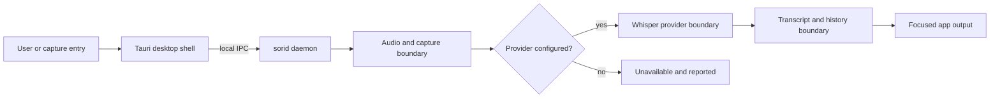

<p align="center">
  
</p>

<p align="center"><sub><a href="docs/assets/sori-logo-wordmark.provenance.md">Asset provenance and usage notice</a></sub></p>

<p align="center"><strong>A local first programmable voice runtime for the desktop.</strong></p>

> Sori is an early Windows first desktop foundation. It is not yet a verified end to end voice typing product.

## Why Sori

Voice software should work close to the person using it. Sori is being built around a short path:

```text
hold a key → speak → produce useful text
```

The project is deliberately honest about the distance between a contract and a working physical voice session. A mock, fixture, rendered screen, or configured model path is not proof of microphone capture, speech inference, or insertion into a focused application.

## What works today

The repository currently provides:

- a Rust `sorid` daemon with lifecycle state and diagnostics
- local HTTP and JSON IPC on `127.0.0.1:17373`
- SQLite migrations and persistence for runtime data
- a React and Tauri desktop shell with a native bridge
- `sori-cli` status and Doctor controls
- capability aware diagnostics that expose unavailable prerequisites
- a Whisper provider boundary that validates executable and model paths

The complete path from hotkey to microphone to ASR to focused app insertion remains `UNVERIFIED` and machine dependent. The [MVP capability matrix](docs/mvp-capability-matrix.md) records the current evidence boundary.

## How it works



The diagram describes software boundaries. It does not claim that physical hotkey delivery, microphone capture, speech recognition, or focused app insertion has passed native acceptance.

## Architecture

The active runtime is split into small boundaries:

| Area | Responsibility |
| --- | --- |
| `crates/sori-core` | Runtime contracts and domain abstractions |
| `crates/sori-ipc` | Local request and response transport |
| `crates/sori-persistence` | SQLite schema and store |
| `crates/sori-provider-whisper` | Whisper command and model boundary |
| `crates/sori-audio` | Audio contracts and capture boundary |
| `crates/sorid` | Authoritative daemon runtime |
| `crates/sori-cli` | Diagnostics and operator controls |
| `apps/desktop` | React and Tauri client |

The daemon owns runtime state. The desktop client is a control surface, not a substitute for runtime evidence.

## Quickstart

### Prerequisites

The primary development target is Windows 10 version 1809 or later. Windows 11 is recommended.

Install:

- Node.js 22 or later and npm
- Rust 1.85 or later with the MSVC toolchain, `rustfmt`, and `clippy`
- Microsoft C++ Build Tools and the Windows SDK
- WebView2 Runtime for the Tauri shell

### Run the daemon

From the repository root:

```powershell
npm ci --prefix apps/desktop
cargo build --workspace
cargo run -p sorid
```

In a second terminal:

```powershell
cargo run -p sori-cli -- doctor
cargo run -p sori-cli -- status
```

The daemon listens only on `127.0.0.1:17373`. If the port is occupied, inspect the owner before stopping anything:

```powershell
Get-NetTCPConnection -LocalPort 17373
```

Run the desktop development shell separately:

```powershell
npm run desktop:dev
```

### Configure the Whisper boundary

A real provider attempt requires an existing `whisper.cpp` executable and compatible model. Sori does not download or vendor those artifacts.

```powershell
$env:SORI_WHISPER_CPP_BIN = 'C:\tools\whisper.cpp\whisper-cli.exe'
$env:SORI_WHISPER_MODEL_DIR = 'C:\models\whisper'
$env:SORI_WHISPER_MODEL = 'ggml-base.en.bin'
```

Configuration is not physical microphone or dictation proof. Missing paths should remain `unavailable` in Doctor.

## Verify changes

Inspect package scripts before running them. The main local checks are:

```powershell
npm ci
npm run check
cargo fmt --all --check
cargo test --workspace
```

Additional contract checks are available:

```powershell
npm run e2e:backend-ipc
npm run e2e:desktop-backend
npm run e2e:product
```

Hardware dependent outcomes must be reported as `UNVERIFIED` or `SKIP` unless a real Windows session observes them.

## Platform boundaries

Sori is Windows first. Portable Rust and web contracts exist, but production support for macOS and Linux is not claimed.

The following areas still require machine level validation or further implementation:

- global hold to talk hotkey
- microphone permissions, capture, and VAD
- packaged Whisper model execution
- focused app text insertion
- packaging, signing, and permission recovery
- complete routing, benchmark, voice edit, extensions, and TTS features

For deeper implementation notes, see the [architecture notes](docs/architecture.md), [backend setup](docs/backend/setup.md), and [dictation pipeline](docs/dictation-pipeline.md).

## Contributing

Start with the issue tracker and existing tests. Keep README claims aligned with the [capability matrix](docs/mvp-capability-matrix.md). Do not commit credentials, model files, recordings, or local databases.

There is no tracked `LICENSE`, `SECURITY.md`, or `CONTRIBUTING.md` file in this checkout. No repository license or security contact is asserted here. Rust workspace metadata is not a substitute for a repository license file.

## Status vocabulary

Sori uses explicit evidence boundaries:

- `VERIFIED` means repository or test evidence supports the claim
- `UNVERIFIED` means the required native or physical observation has not been completed
- `SKIP` means the environment did not permit a meaningful check
- `BLOCKED` means a required dependency or gate prevented the check

The project prefers a precise limitation over a confident claim without evidence.
